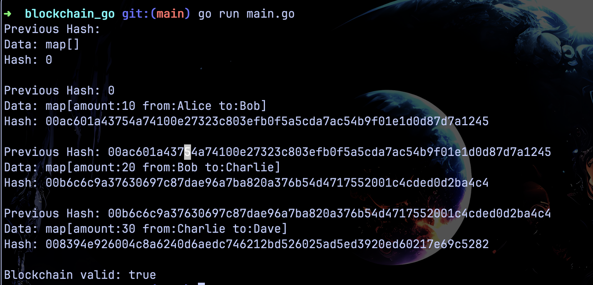

# Blockchain written in Go



## Installation
### Prerequisites
Before you start make sure you have set up the following:  
- [Go](https://go.dev)

### Building
1. Clone this repository:
```sh
git clone https://github.com/pesho65/blockchain_go.git
```

## Usage
First run the main.go file while in the project folder

```sh
go run main.go
```
You can experiment by adding more values to the block chain in the main.go file
